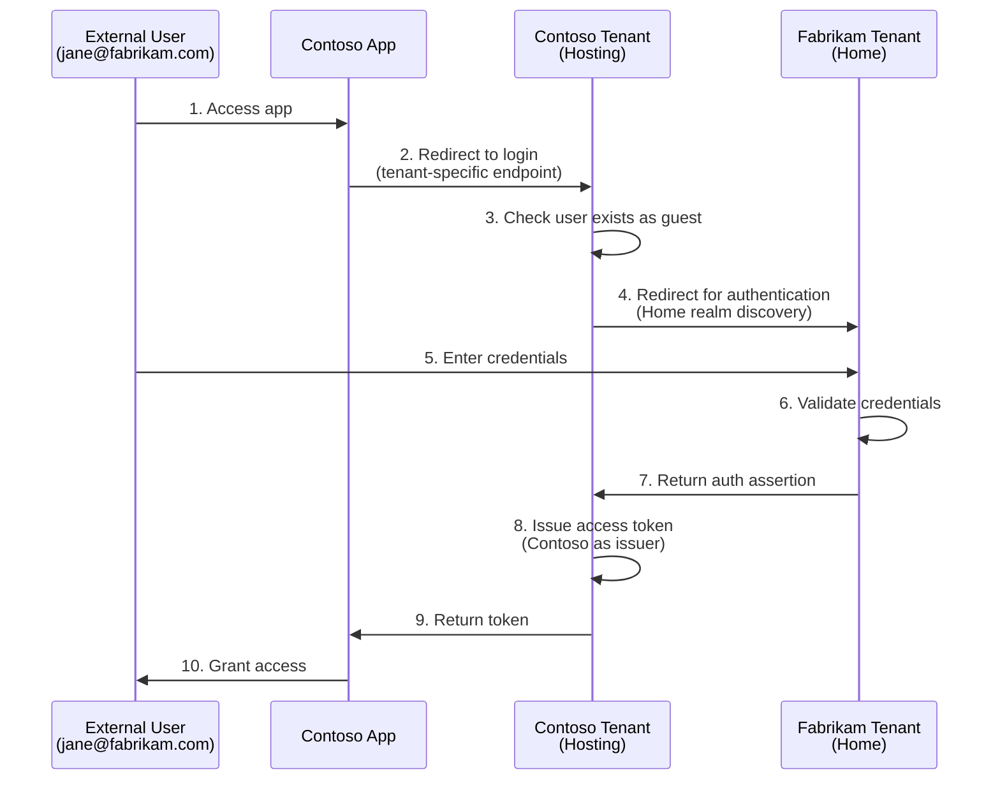
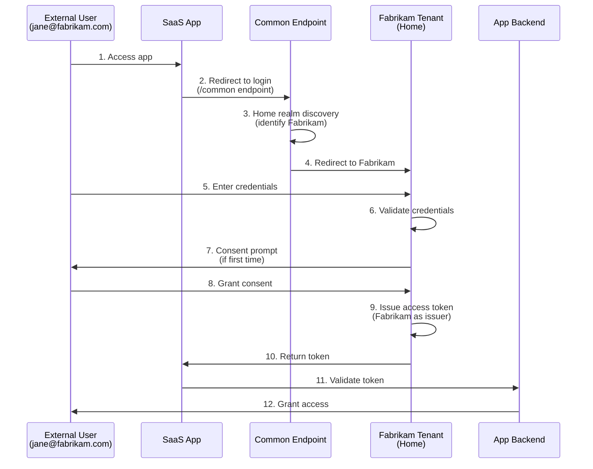

## Overview

This article provides a comprehensive guide to understanding **<mark>how external user authentication works** in Azure Active Directory (Azure AD). 

**<mark>External users**, whether they use **<mark>personal Microsoft accounts** or belong to **<mark>other organizations**, need proper authentication mechanisms to access your resources securely.

The article explores the two primary authentication models (**<mark>Single-Tenant** and **<mark>Multi-Tenant**), explains how each works, and helps you choose the right approach based on your security, governance, and scalability requirements. 

You'll learn about the necessary configurations, authentication flows, and trade-offs between different approaches.

## 📑 Table of Contents

- [🔑 Key Concepts & Terminology](#-key-concepts--terminology)
- [🏗 Understanding External Identities in Azure AD](#-understanding-external-identities-in-azure-ad)
  - [What is an External User?](#what-is-an-external-user)
  - [Identity Types: Personal vs Organizational](#identity-types-personal-vs-organizational)
- [🔐 Authentication Models](#-authentication-models)
  - [Single-Tenant Applications](#single-tenant-applications)
  - [Multi-Tenant Applications](#multi-tenant-applications)
- [🔄 How Authentication Works](#-how-authentication-works)
  - [Single-Tenant Authentication Flow](#single-tenant-authentication-flow)
  - [Multi-Tenant Authentication Flow](#multi-tenant-authentication-flow)
  - [Token Issuance and Authority](#token-issuance-and-authority)
  - [Endpoint Differences](#endpoint-differences)
- [⚙️ Configuration Scenarios](#️-configuration-scenarios)
  - [External User with Public Account](#external-user-with-public-account)
  - [External User with Azure AD Account from Another Tenant](#external-user-with-azure-ad-account-from-another-tenant)
- [✅ Required Configurations](#-required-configurations)
  - [Hosting Tenant (Local Azure AD)](#hosting-tenant-local-azure-ad)
  - [Remote Tenant (If Applicable)](#remote-tenant-if-applicable)
- [� Security Considerations](#-security-considerations)
  - [Trust Boundaries](#trust-boundaries)
  - [Token Validation](#token-validation)
  - [Conditional Access Policies](#conditional-access-policies)
  - [Compromise Scenarios](#compromise-scenarios)
- [📊 Comparing the Approaches](#-comparing-the-approaches)
- [🛠 Choosing the Right Model](#-choosing-the-right-model)
- [📚 References](#-references)

---

## 🔑 Key Concepts & Terminology

Before diving into authentication models, it's essential to understand the core concepts and terminology used throughout this guide.

### Azure AD Tenant

An **<mark>Azure AD tenant** is a dedicated instance of Azure Active Directory that represents your organization. Think of it as your organization's identity directory in the cloud.

- Each tenant has a unique identifier (<mark>Tenant ID</mark>)
- Contains users, groups, applications, and security policies
- Example: `contoso.onmicrosoft.com`

### Home Tenant vs Hosting Tenant

Understanding the distinction between these two concepts is crucial for external user authentication:

**<mark>Home Tenant (Identity Provider)</mark>**:
- The Azure AD tenant where the user's identity originates
- Manages the user's credentials and profile
- Issues authentication tokens (in multi-tenant scenarios)
- Example: A Fabrikam employee's home tenant is `fabrikam.onmicrosoft.com`

**<mark>Hosting Tenant (Resource Provider)</mark>**:
- The Azure AD tenant that owns the resources being accessed
- Hosts the application registration
- Controls access policies and permissions
- Example: Contoso's tenant `contoso.onmicrosoft.com` hosting the application

### Guest User vs Member User

Azure AD distinguishes between internal and external users:

**<mark>Member User**:
- Native user account in your Azure AD tenant
- Full member of your organization's directory
- UserType: `Member`
- Example: `john@contoso.com` in Contoso's tenant

**<mark>Guest User**:
- External identity invited to access your resources
- Limited permissions by default
- UserType: `Guest`
- Displayed with `#EXT#` in the username
- Example: `jane_fabrikam.com#EXT#@contoso.onmicrosoft.com`

### App Registration

An **<mark>app registration** is how you register your application with Azure AD to enable authentication:

- <mark>Defines who can sign in</mark> (<mark>single-tenant</mark>, <mark>multi-tenant</mark>, <mark>personal accounts<&mark>)
- Specifies <mark>API permissions</mark> the app requires
- Contains <mark>redirect URIs for OAuth flows</mark>
- Generates <mark>Client ID</mark> and <mark>optionally Client Secret</mark>

**Key Settings**:

Supported account types:
  - Accounts in this **organizational directory only** (<mark>Single tenant</mark>)
  - Accounts in **any organizational directory** (<mark>Multi-tenant</mark>)
  - Accounts in **any organizational directory and personal Microsoft accounts**
  - **Personal Microsoft accounts only**


### B2B (Business-to-Business) Collaboration

<mark>**Azure AD B2B**</mark> is a <mark>feature</mark> that enables secure sharing of applications and services with external users while maintaining control over your data:

- <mark>External users are **invited as guests**</mark>
- <mark>Users authenticate</mark> with their <mark>**home credentials**<mark>
- <mark>**No need for the guest to create a new password**</mark>
- <mark>Guest accounts appear in your directory for access management</mark>

### Home Realm Discovery

**<mark>Home realm discovery** is the process of determining which identity provider should authenticate a user:

- User enters their <mark>email/username
- Azure AD identifies the <mark>user's home tenant
- <mark>Redirects to the appropriate login page
- <mark>Handles automatically in multi-tenant scenarios

Example: When `jane@fabrikam.com` signs into a Contoso app, Azure AD detects Fabrikam as the home realm and redirects to Fabrikam's login page.

---

## 🏗 Understanding External Identities in Azure AD

### What is an External User?

An external user is anyone outside your organization who needs access to your resources. External users can authenticate using different types of credentials:

- **<mark>Public account** (e.g., Outlook.com, Gmail via Microsoft account)
- **<mark>Azure AD account** from another organization

### Identity Types: Personal vs Organizational

Azure AD supports two primary types of external identities:

- **<mark>Personal Microsoft Account (MSA)**: Includes Outlook.com, Hotmail, Xbox, and other consumer Microsoft services
- **<mark>Work or School Account**: Managed by an organization within their own Azure AD tenant

---

## 🔐 Authentication Models

Azure AD offers two distinct authentication models for handling external users, each with different security and operational characteristics.

### Single-Tenant Applications

**<mark>Scope**: Only users from your tenant can sign in directly.

**<mark>External Access**: Requires creating an Azure AD object for the external user:
- Full member account, or
- B2B guest account

**Advantages**:
- Strong governance and compliance control
- Centralized user management
- Detailed audit trails

**Disadvantages**:
- Administrative overhead for invitations
- Manual account lifecycle management
- Slower onboarding process

### Multi-Tenant Applications

**<mark>Scope**: Users from any Azure AD tenant and optionally personal Microsoft accounts can sign in.

**<mark>External Access**: No account creation in your tenant required—users authenticate with their home identity.

**Advantages**:
- Easy and fast onboarding
- Highly scalable for SaaS scenarios
- No account management overhead

**Disadvantages**:
- Less control over external identities
- Dependency on user's home tenant
- Requires trust in Microsoft identity platform validation

---

## 🔄 How Authentication Works

Understanding the authentication flow is essential for troubleshooting issues and optimizing your implementation. 
The flow differs significantly between single-tenant and multi-tenant models.

### Single-Tenant Authentication Flow

In a single-tenant scenario with a guest user from another organization:



**Key Points**:
1. **<mark>Guest account must exist** in Contoso's directory before authentication
2. User authenticates against their **<mark>home tenant** (Fabrikam)
3. Token is **<mark>issued by the hosting tenant** (Contoso)
4. Contoso controls token claims and permissions
5. Uses **<mark>tenant-specific endpoint**: `https://login.microsoftonline.com/{contoso-tenant-id}/...`

### Multi-Tenant Authentication Flow

In a multi-tenant scenario where any organization can sign in:



**Key Points**:
1. **<mark>No pre-existing account** needed in the app's tenant
2. User authenticates against their **<mark>home tenant** (Fabrikam)
3. Token is **<mark>issued by the home tenant** (Fabrikam)
4. **<mark>Consent flow** establishes trust on first sign-in
5. Uses **<mark>common endpoint**: `https://login.microsoftonline.com/common/...`
6. App validates token from any trusted issuer

### Token Issuance and Authority

The issuer of the authentication token differs fundamentally between the two models:

**Single-Tenant Flow**:
- **Issuer**: Hosting tenant (your Azure AD)
- **Authority**: Your tenant is the authority for the token
- **Token claims**: Contains claims from your tenant's perspective
- **User attributes**: Guest user attributes are maintained in your directory
- **Token example**:
  ```json
  {
    "iss": "https://sts.windows.net/contoso-tenant-id/",
    "tid": "contoso-tenant-id",
    "oid": "guest-object-id-in-contoso",
    "upn": "jane_fabrikam.com#EXT#@contoso.onmicrosoft.com"
  }
  ```

**Multi-Tenant Flow**:
- **Issuer**: User's home tenant
- **Authority**: Home tenant is the authority for the token
- **Token claims**: Contains claims from the user's home tenant
- **User object**: No user object created in your tenant
- **Token example**:
  ```json
  {
    "iss": "https://sts.windows.net/fabrikam-tenant-id/",
    "tid": "fabrikam-tenant-id",
    "oid": "user-object-id-in-fabrikam",
    "upn": "jane@fabrikam.com"
  }
  ```

### Endpoint Differences

The authentication endpoint you use determines which model applies:

**Single-Tenant Login Endpoint**:
```
https://login.microsoftonline.com/<tenant_id>/oauth2/v2.0/authorize
```
- **Tenant-specific** endpoint using your tenant ID or domain
- Only accepts users from your tenant (including guests)
- Provides strongest isolation
- Example: `https://login.microsoftonline.com/contoso.onmicrosoft.com/oauth2/v2.0/authorize`

**Multi-Tenant Login Endpoint**:
```
https://login.microsoftonline.com/common/oauth2/v2.0/authorize
```
- **Common endpoint** accepts any Azure AD tenant
- Also accepts personal Microsoft accounts (if configured in app registration)
- Handles home realm discovery automatically
- Redirects users to their home tenant for authentication

**Alternative Multi-Tenant Endpoint**:
```
https://login.microsoftonline.com/organizations/oauth2/v2.0/authorize
```
- Accepts only work/school accounts from any organization
- Excludes personal Microsoft accounts
- Useful when you want organizational accounts only

---

## ⚙️ Configuration Scenarios

Understanding how external users authenticate in different scenarios helps you choose the appropriate model for your needs. Let's explore real-world examples.

### External User with Public Account

**Example**: User with Outlook.com or Gmail account

**Real-World Scenario**: 
Contoso is organizing a webinar and wants to give external consultants (who don't have organizational accounts) access to their event management portal.

**Single-Tenant Approach**:
- Invite the user as a B2B guest: `consultant@outlook.com`
- User receives email invitation and redeems it
- User appears in your directory as `consultant_outlook.com#EXT#@contoso.onmicrosoft.com`
- Full control over access permissions via Azure AD groups and roles
- Can assign specific app roles and set expiration dates
- Track user activity in your audit logs

**When to use**: Limited number of known external users, need full governance control

**Multi-Tenant Approach**:
- Configure app registration: "Accounts in any organizational directory and personal Microsoft accounts"
- User navigates to app URL
- User signs in directly with `consultant@outlook.com` without invitation
- No guest account created in your tenant
- User grants consent on first sign-in
- Access managed through application logic, not Azure AD

**When to use**: Public-facing apps, self-service onboarding, minimal administrative overhead

### External User with Azure AD Account from Another Tenant

**Example**: User from partner organization with their own Azure AD

**Real-World Scenario**: 
Contoso (manufacturing) collaborates with Fabrikam (supplier). Fabrikam employees need access to Contoso's procurement portal to submit quotes and track orders.

**Single-Tenant Approach**:

1. **Invitation Process**:
   - Contoso admin invites `jane@fabrikam.com` as B2B guest
   - Jane receives invitation email
   - Jane clicks "Accept invitation"
   - Guest account created: `jane_fabrikam.com#EXT#@contoso.onmicrosoft.com`

2. **Authentication Flow**:
   - Jane navigates to Contoso's procurement portal
   - Redirected to login: `https://login.microsoftonline.com/contoso.onmicrosoft.com/...`
   - Contoso AD recognizes Jane as guest, redirects to Fabrikam for authentication
   - Jane enters credentials in Fabrikam's login page
   - Fabrikam validates credentials and returns assertion to Contoso
   - Contoso issues access token
   - Jane accesses portal

3. **Management**:
   - Contoso can assign Jane to "Suppliers" group
   - Apply conditional access: require MFA, restrict to Fabrikam IP ranges
   - Set guest access expiration (e.g., when contract ends)
   - Monitor Jane's activity in Contoso's audit logs

**When to use**: Ongoing partner relationships, need governance and compliance controls, specific users from known organizations

**Multi-Tenant Approach**:

1. **Initial Access**:
   - Contoso publishes SaaS procurement portal
   - App registration: "Accounts in any organizational directory"
   - No invitation needed
   - Jane navigates to portal URL

2. **First Sign-In Flow**:
   - Jane clicks "Sign in"
   - Redirected to: `https://login.microsoftonline.com/common/...`
   - Enters `jane@fabrikam.com`
   - Home realm discovery identifies Fabrikam tenant
   - Redirected to Fabrikam login
   - Jane authenticates with Fabrikam credentials
   - **Consent prompt**: "Contoso Procurement Portal wants to access your profile"
   - Jane grants consent
   - Fabrikam issues token, Jane accesses portal

3. **Subsequent Sign-Ins**:
   - No consent prompt (already granted)
   - Direct authentication through Fabrikam
   - Seamless access

4. **Management**:
   - No user object in Contoso tenant
   - Access control via application logic (e.g., subscription tiers)
   - Contoso trusts Fabrikam's user validation
   - Limited visibility into individual user actions

**When to use**: SaaS applications, allow any organization to sign up, scale to thousands of organizations

### Hybrid Scenario: Multi-Tenant with Selective B2B

**Real-World Scenario**: 
Contoso offers a SaaS project management tool (multi-tenant) but also has enterprise clients who require additional governance for their users.

**Approach**:
- **General users**: Multi-tenant app, self-service sign-up
- **Enterprise client users**: Invited as B2B guests, managed in dedicated groups
- App logic detects guest users and applies enterprise policies
- Best of both worlds: scalability + control where needed

---

## ✅ Required Configurations

### Hosting Tenant (Local Azure AD)

**For Single-Tenant Applications**:

```
Supported account types: Accounts in this organizational directory only
External collaboration settings: Allow guest access
```

Key settings to configure:
- Enable B2B collaboration
- Configure guest user permissions
- Set up access reviews (optional but recommended)

**For Multi-Tenant Applications**:

```
Supported account types: Accounts in any organizational directory and personal Microsoft accounts
Consent settings: Enable user consent or admin consent for external users
```

Key settings to configure:
- Define required API permissions
- Configure consent policies
- Set up publisher verification (recommended)

### Remote Tenant (If Applicable)

**For Single-Tenant Applications**:
- No special configuration required in the remote tenant
- Guest invitation process handles the trust relationship
- Remote tenant admin can control if users can accept invitations

**For Multi-Tenant Applications**:
- No configuration required in remote tenant
- User provides consent during first sign-in
- Remote tenant admin can restrict which apps users can consent to

---

## 🔒 Security Considerations

Understanding the security implications of each authentication model is critical for protecting your resources and data.

### Trust Boundaries

**Single-Tenant Model**:
- **Trust boundary**: Your Azure AD tenant
- You control the guest user lifecycle
- Guest users are subject to your tenant's security policies
- You decide which external identities to trust (via invitation)
- Stronger security posture through explicit trust establishment

**Multi-Tenant Model**:
- **Trust boundary**: Microsoft Identity Platform
- You trust any Azure AD tenant (or MSA) that Microsoft validates
- No pre-authorization of external organizations
- Security depends on proper token validation in your app
- Broader attack surface due to open access

### Token Validation

Proper token validation is essential, especially in multi-tenant scenarios:

**What to Validate**:

1. **Signature**: Verify token is signed by Microsoft identity platform
   ```csharp
   // Token signature is validated automatically by Microsoft libraries
   ```

2. **Issuer (iss claim)**:
   - Single-tenant: Must match your tenant
   - Multi-tenant: Can be any trusted issuer
   ```csharp
   // Single-tenant validation
   ValidIssuers = new[] { $"https://sts.windows.net/{tenantId}/" }
   
   // Multi-tenant validation
   ValidateIssuer = true  // Validates against known Microsoft issuers
   ```

3. **Audience (aud claim)**: Must match your app's Client ID
   ```csharp
   ValidAudiences = new[] { clientId }
   ```

4. **Expiration (exp claim)**: Token must not be expired

5. **Tenant ID (tid claim)**: 
   - Consider maintaining an allow-list of trusted tenant IDs
   - Reject tokens from unknown or untrusted tenants
   ```csharp
   var allowedTenants = new[] { "fabrikam-tenant-id", "contoso-tenant-id" };
   if (!allowedTenants.Contains(claimsPrincipal.GetTenantId()))
   {
       throw new SecurityTokenValidationException("Tenant not allowed");
   }
   ```

### Conditional Access Policies

Conditional Access policies apply differently based on authentication model:

**Single-Tenant (B2B Guest)**:

- **Hosting tenant policies apply**: Your conditional access policies are enforced
- **Home tenant policies may apply**: Depends on B2B collaboration settings
- **Typical policies**:
  - Require MFA for all guest users
  - Block access from specific countries
  - Require compliant devices for guests
  - Limit guest access to specific applications

**Example Configuration**:
```
Policy: Require MFA for Guests
- Users: All guest users
- Cloud apps: Procurement Portal
- Conditions: Any location
- Access controls: Require MFA
```

**Multi-Tenant**:

- **Only home tenant policies apply**: You cannot enforce conditional access
- **Application must enforce policies**: Security logic must be in your code
- **Considerations**:
  - Cannot require MFA (home tenant decides)
  - Cannot enforce device compliance
  - Must rely on application-level controls

**Mitigation Strategies**:
```csharp
// Application-level controls in multi-tenant apps
if (user.RequiresMFA && !user.HasMFAClaim)
{
    return Challenge(); // Force step-up authentication
}

if (user.RiskLevel == "High")
{
    return Forbid(); // Block high-risk users
}
```

### Compromise Scenarios

Understanding what happens when security is breached helps you plan defenses:

#### Scenario 1: Guest User's Home Tenant is Compromised

**Single-Tenant (B2B)**:
- Attacker gains access to Fabrikam tenant
- Can authenticate as Jane from Fabrikam
- Your conditional access policies still apply (may catch anomalies)
- You can **immediately revoke** Jane's guest account
- You can **disable all Fabrikam guests** as a batch

**Mitigation**:
- Enable access reviews to regularly validate guest access
- Monitor for unusual sign-in patterns
- Implement short-lived access with expiration dates
- Use privileged identity management (PIM) for sensitive roles

**Multi-Tenant**:
- Attacker gains access to Fabrikam tenant
- Can authenticate as any Fabrikam user to your app
- **No ability to revoke access** (no guest accounts in your tenant)
- Must rely on application logic to detect and block

**Mitigation**:
- Implement anomaly detection in your application
- Rate limiting and abuse detection
- Maintain user reputation scores
- Emergency tenant block-list capability

#### Scenario 2: Token Theft

**Single-Tenant**:
- Stolen token is issued by your tenant
- Contains your tenant's claims and policies
- Token lifetime controlled by your token policies
- Can revoke refresh tokens in your tenant

**Multi-Tenant**:
- Stolen token is issued by user's home tenant
- **Cannot revoke tokens** from your side
- Must wait for token expiration
- Implement token binding and additional validation

**Mitigation for Both**:
```csharp
// Implement continuous access evaluation (CAE)
// Bind tokens to specific IP addresses or devices
if (token.IpAddress != currentRequest.IpAddress)
{
    return Unauthorized();
}
```

#### Scenario 3: Malicious Organization Signup

**Multi-Tenant Specific Risk**:
- Attacker creates "evil-corp.onmicrosoft.com"
- Signs up for your SaaS app
- Potentially abuses free tier or probes for vulnerabilities

**Mitigation**:
- Implement tenant allow-list/block-list
- Require email verification
- Monitor for abuse patterns
- Implement tenant-based rate limiting
```csharp
var blockedTenants = GetBlockedTenants();
if (blockedTenants.Contains(user.TenantId))
{
    return Forbid("Your organization has been blocked");
}
```

### Security Best Practices Summary

**For Single-Tenant Applications**:
1. ✅ Enable B2B cross-tenant access settings
2. ✅ Configure conditional access for guest users
3. ✅ Implement access reviews (quarterly or bi-annually)
4. ✅ Set guest access expiration dates
5. ✅ Monitor guest user activity in audit logs
6. ✅ Limit guest user permissions (restrict by default)
7. ✅ Require MFA for all guest access

**For Multi-Tenant Applications**:
1. ✅ Implement robust token validation (signature, issuer, audience, expiration)
2. ✅ Validate tenant ID against allow-list (if applicable)
3. ✅ Implement application-level access controls
4. ✅ Monitor for abuse and anomalous behavior
5. ✅ Implement rate limiting per tenant
6. ✅ Use short-lived access tokens
7. ✅ Implement emergency tenant block-list capability
8. ✅ Require publisher verification for production apps
9. ✅ Log all authentication events for security analysis
10. ✅ Implement continuous access evaluation (CAE)

---

## 📊 Comparing the Approaches

| Model | Pros | Cons |
|-------|------|------|
| **Single-Tenant** | • Strong governance and compliance control<br>• Centralized user management<br>• Detailed audit trails<br>• Direct control over user lifecycle | • Administrative overhead for invitations<br>• Slower onboarding process<br>• Manual account management required<br>• Not scalable for large external user bases |
| **Multi-Tenant** | • Easy and fast onboarding<br>• Highly scalable for SaaS scenarios<br>• No account management overhead<br>• Broad reach across organizations | • Less control over external identities<br>• Dependency on user''s home tenant<br>• Limited governance capabilities<br>• Trust in Microsoft identity platform required |

---

## 🛠 Choosing the Right Model

**Use Single-Tenant when**:
- Building internal applications
- Compliance requires full control over user identities
- You need detailed audit trails and governance
- Working with a limited, known set of external users
- Strong security and data residency requirements apply

**Use Multi-Tenant when**:
- Building SaaS applications for external customers
- Onboarding external users at scale
- Fast, frictionless user onboarding is a priority
- You trust Microsoft''s identity platform for validation
- Managing individual user accounts is not feasible

---

## 📚 References

### Official Microsoft Documentation

**[Azure AD B2B Collaboration](https://learn.microsoft.com/en-us/azure/active-directory/external-identities/what-is-b2b)**
- Comprehensive guide to Azure AD B2B guest user concepts and external collaboration features
- Essential reading for understanding Single-Tenant scenarios with guest users
- Covers invitation process, redemption flow, and guest user lifecycle management

**[Supported Account Types in Azure AD](https://learn.microsoft.com/en-us/azure/active-directory/develop/supported-account-types)**
- Detailed explanation of app registration configuration options
- Critical for understanding the differences between Single-Tenant and Multi-Tenant app configurations
- Provides guidance on choosing the appropriate account type for your scenario

**[OAuth 2.0 Authorization Code Flow](https://learn.microsoft.com/en-us/azure/active-directory/develop/v2-oauth2-auth-code-flow)**
- Technical deep-dive into authentication endpoints and token issuance mechanisms
- Explains the OAuth 2.0 flow used by Azure AD for both single and multi-tenant apps
- Includes code samples and endpoint specifications

**[Azure AD Consent Framework](https://learn.microsoft.com/en-us/azure/active-directory/develop/consent-framework)**
- Explains user consent and admin consent mechanisms
- Critical for understanding Multi-Tenant application permissions and consent flows
- Covers tenant-wide admin consent and user-level consent scenarios

**[External Identities Documentation](https://learn.microsoft.com/en-us/azure/active-directory/external-identities/)**
- Complete documentation hub for Azure AD External Identities
- Covers B2B, B2C, and direct federation scenarios
- Provides best practices and implementation guidance

**[Microsoft Identity Platform Overview](https://learn.microsoft.com/en-us/azure/active-directory/develop/v2-overview)**
- Overview of the Microsoft identity platform architecture
- Explains authentication and authorization across different application types
- Relevant for understanding the foundation of both authentication models discussed in this article
