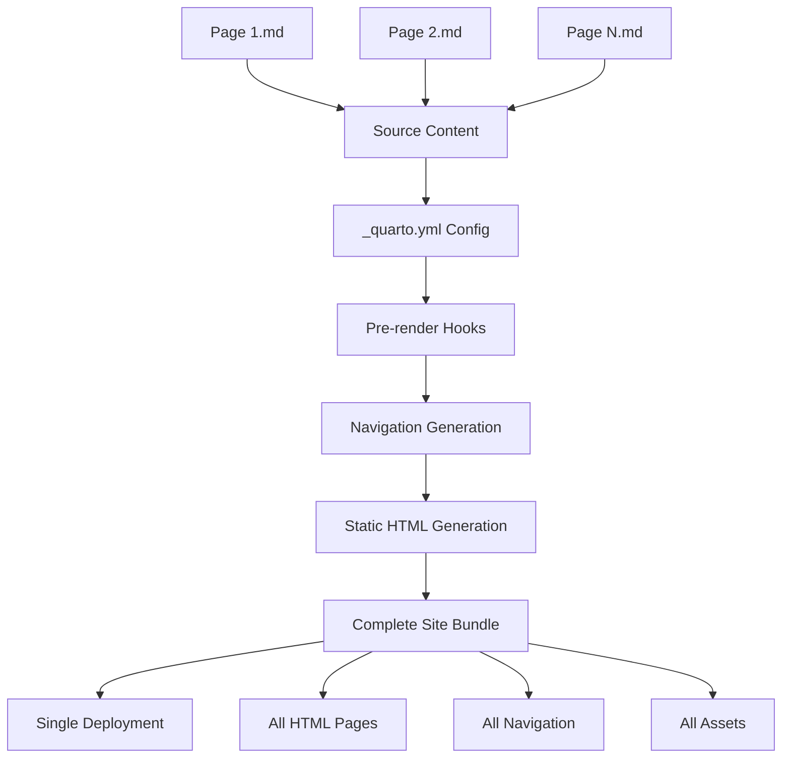
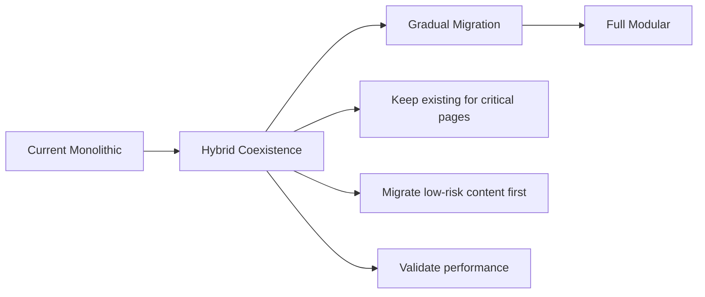
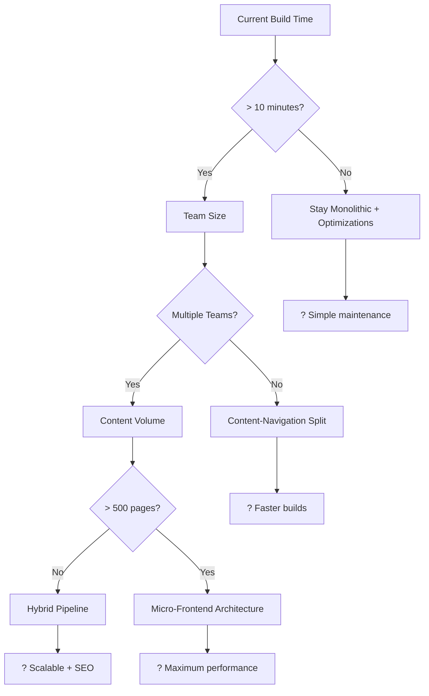

# Monolithic vs. Modular Deployment

## 📋 **Table of Contents**

- [📖 Overview](#-overview)
- [🏗️ Monolithic vs. Modular Deployment](#️-monolithic-vs-modular-deployment)
- [🔧 Modular Architecture Strategies](#-modular-architecture-strategies)
- [📊 Architecture Comparison Matrix](#-architecture-comparison-matrix)
- [🗺️ Implementation Roadmap](#️-implementation-roadmap)
- [⚙️ Technical Implementation Details](#️-technical-implementation-details)
- [⚖️ Benefits and Trade-offs Analysis](#️-benefits-and-trade-offs-analysis)
- [💡 Recommendations](#-recommendations)
- [📖 References and Further Reading](#-references-and-further-reading)
- [📊 Appendix A: Detailed Analysis](#-appendix-a-detailed-analysis)

---

## 📖 **Overview**

This document focuses specifically on **deployment architecture strategies** for Quarto sites, exploring how to move from monolithic deployment to modular approaches where **static site infrastructure and content pages can be deployed independently**.

> **Note**: For understanding how Quarto's core architecture and rendering works, see [01-how-quarto-works.md](01.02-how-quarto-works.md).

**Key Questions Addressed:**

- Can **individual pages be built independently** from the static site logic?
- How can **content and navigation be deployed separately**?
- What are the performance implications of different deployment approaches?
- When should you consider modular vs. monolithic deployment strategies?

**Real-World Context:**

Based on analysis of the Learn repository implementation, this document provides practical strategies for scaling Quarto sites while maintaining the benefits of static generation.

## 🏗️ **Monolithic vs. Modular Deployment**

### Default Monolithic Approach

Quarto's default deployment follows a **monolithic pattern** where all components deploy together:



**Monolithic Characteristics:**

- **Atomic Builds**: <mark>deployment is slower</mark>, <mark>all pages are rendered at each deployment</mark>
- **Consistent State**: Navigation always matches available content
- **Cross-References**: Pages can reference each other during build
- **Single Deployment Unit**: Entire site deploys as one package

**Example from Learn Repository:**
```yaml
# _quarto.yml - Everything builds together
project:
  type: website
  output-dir: docs
  pre-render: 
    - powershell -ExecutionPolicy Bypass -File scripts/generate-navigation.ps1
  render:
    - "*.qmd"
    - "*.md"
    - "**/README.md"    # All pages must exist during build
```

### When Sites Grow: Modular Alternatives

As Quarto sites grow in size and complexity, the monolithic approach can become a bottleneck. For large sites, consider **modular deployment strategies**:

**Key Modular Concepts:**

1. **Separate Navigation from Content**: Build the site shell (navigation, layout, search) independently from content pages
2. **Split Content Rendering**: Organize content into logical blocks that can be built and deployed separately
3. **Individual Page Rendering**: In extreme cases, render and deploy individual pages independently

**When to Consider Modular Approaches:**

- **Build times** consistently exceed 10-15 minutes
- **Multiple teams** contributing content simultaneously  
- **High-frequency updates** (multiple times per day)
- **Large content volume** (500+ pages)

> 📊 **See [Appendix A: Detailed Analysis](#appendix-a-detailed-analysis)** for comprehensive metrics, decision frameworks, and implementation strategies.

### Development Workflow Impact

**Current Workflow:**

```bash
# Typical development cycle
git pull origin main
# Edit content file
quarto render          # Full site rebuild (2-5 minutes)
git add .
git commit -m "Update content"
git push origin main   # Triggers GitHub Actions (3-5 minutes)
```

**Team Collaboration Issues:**

- **Queue Conflicts**: Multiple developers triggering builds
- **Feedback Delay**: Long cycles reduce iteration speed
- **Resource Contention**: GitHub Actions runner limitations

## 🔧 **Modular Architecture Strategies**

### Strategy 1: Content-Navigation Separation

**Concept**: Split content generation from navigation/shell infrastructure.

```
Current Monolithic:
┌─────────────────────────────┐
│      Monolithic Build       │
│  ┌─────────────────────┐    │
│  │Content│  Nav │Shell │    │
│  │ Pages │ Menu │Layout│    │
│  └─────────────────────┘    │
└─────────────────────────────┘

Separated Architecture:
┌─────────┐  ┌──────────┐  ┌─────────┐
│ Content │  │Navigation│  │  Shell  │
│  Build  │  │  Build   │  │  Build  │
│         │  │          │  │         │
└─────────┘  └──────────┘  └─────────┘
     │            │            │
     └────────────┼────────────┘
                  │
          ┌───────────────┐
          │  Deployment   │
          │ Composition   │
          └───────────────┘
```

**File Structure:**
```
Learn-Modular/
├── content/                    # Content-only builds
│   ├── build-2025/
│   │   ├── _quarto.yml        # Minimal content config
│   │   └── sessions/
│   ├── azure-topics/
│   │   ├── _quarto.yml
│   │   └── guides/
│   └── tools/
├── navigation/                 # Navigation-only builds  
│   ├── _quarto.yml            # Shell configuration
│   ├── templates/
│   └── scripts/
├── deploy/                     # Composition layer
│   ├── content/               # Generated content pages
│   ├── shell/                 # Generated navigation shell
│   └── merged/                # Final deployment bundle
└── orchestration/              # Build coordination
    ├── build-content.ps1
    ├── build-navigation.ps1
    └── deploy-merged.ps1
```

**Benefits:**

- ✅ **Independent Builds**: Content and navigation build separately
- ✅ **Faster Updates**: Only rebuild what changed
- ✅ **Team Independence**: Content teams don't block navigation updates
- ✅ **Selective Deployment**: Deploy only changed components

### Strategy 2: Micro-Frontend Architecture

**Concept**: Deploy individual pages as independent micro-sites with shared navigation.

```yaml
# content/brk101/_quarto.yml - Standalone page configuration
project:
  type: website
  output-dir: ../../deploy/pages/brk101

website:
  title: "BRK101: .NET Modernization"
  navbar: false           # No local navigation
  sidebar: false          # No local sidebar

format:
  html:
    theme: cosmo
    template-partials:
      - ../../shared/navigation.html
    standalone: false     # Allows shared resources
    embed-resources: false
```

**Client-Side Composition:**

```javascript
// Micro-frontend loader
class MicroFrontendLoader {
  async loadPage(pageId) {
    const [navigation, content] = await Promise.all([
      this.loadNavigation(),
      this.loadPageContent(pageId)
    ]);
    
    this.renderShell(navigation);
    this.renderContent(content);
  }
  
  async loadNavigation() {
    // Cache navigation for 1 hour
    const cached = this.getFromCache('navigation', 3600000);
    if (cached) return cached;
    
    const nav = await fetch('/api/navigation').then(r => r.json());
    this.setCache('navigation', nav);
    return nav;
  }
}
```

**Deployment Pattern:**

```
Main Site:     https://darioairoldi.github.io/Learn/
Individual:    https://darioairoldi.github.io/Learn/pages/brk101.html
               https://darioairoldi.github.io/Learn/pages/azure-naming.html
```

### Strategy 3: Headless Content with Dynamic Shell

**Concept**: Generate content-only pages and compose with dynamic navigation at runtime.

```yaml
# Headless content configuration
format:
  html:
    theme: none
    template: headless-content.html
    page-layout: article
    embed-resources: false
```

```html
<!-- headless-content.html template -->
<article class="content-only" data-page-id="{{page-id}}">
  <header>
    <h1>{{title}}</h1>
    <meta name="description" content="{{description}}">
  </header>
  
  <main>
    {{content}}
  </main>
  
  <footer>
    <meta name="last-modified" content="{{date-modified}}">
  </footer>
</article>
```

**Dynamic Shell Integration:**
```javascript
// Shell composition at runtime
async function composePage() {
  const shell = await fetch('/shell/template.html');
  const content = await fetch(window.location.pathname + '?content-only=true');
  const navigation = await fetch('/api/navigation.json');
  
  document.body.innerHTML = await this.compose(shell, content, navigation);
}
```

### Strategy 4: Hybrid Build Pipeline

**Concept**: Combine benefits of static generation with selective rebuilding.

```yaml
# Hybrid pipeline configuration
project:
  type: hybrid
  output-dir: deploy/hybrid
  
  # Content builds (independent)
  content-pipelines:
    - name: "build-2025"
      source: "202506-build-2025/**/*.md"
      output: "content/build-2025/"
      triggers:
        - "202506-build-2025/**"
    
    - name: "azure-topics" 
      source: "2025*Azure*/**/*.md"
      output: "content/azure/"
      triggers:
        - "2025*Azure*/**"
  
  # Navigation builds (centralized)
  navigation-pipeline:
    source: "_quarto.yml"
    output: "shell/"
    triggers:
      - "_quarto.yml"
      - "navigation/**"
      
  # Composition (automatic)
  compose-triggers:
    - content-pipelines
    - navigation-pipeline
```

## 📊 **Architecture Comparison Matrix**

| Aspect | Monolithic (Current) | Content-Navigation Split | Micro-Frontend | Headless + Dynamic | Hybrid Pipeline |
|--------|---------------------|--------------------------|----------------|-------------------|-----------------|
| **Build Speed** | ?? | ???? | ????? | ??? | ???? |
| **Deployment Speed** | ?? | ???? | ????? | ???? | ???? |
| **Complexity** | ????? | ??? | ?? | ?? | ??? |
| **Consistency** | ????? | ???? | ??? | ??? | ???? |
| **SEO Performance** | ????? | ????? | ??? | ?? | ???? |
| **Development DX** | ?? | ???? | ????? | ??? | ???? |
| **Maintenance** | ????? | ??? | ?? | ?? | ??? |
| **Rollback Safety** | ??? | ????? | ????? | ???? | ???? |

## 🗺️ **Implementation Roadmap**

### Phase 1: Assessment and Planning

**Duration**: 1-2 weeks

**Objectives**:

- Analyze current content update patterns
- Identify high-frequency vs. low-frequency content
- Map team workflows and pain points
- Define success metrics

**Deliverables**:
```
assessment-report.md
??? Current performance baseline
??? Content categorization matrix
??? Team workflow analysis
??? Technical debt assessment
??? ROI projections for each strategy
```

**Implementation Steps**:
1. **Performance Baseline**: Measure current build times across different scenarios
2. **Content Analysis**: Categorize content by update frequency and dependencies
3. **Team Survey**: Gather feedback on current development workflow pain points
4. **Technical Assessment**: Evaluate infrastructure requirements for each strategy

### Phase 2: Proof of Concept

**Duration**: 2-3 weeks

**Objectives**:

- Implement minimal viable version of chosen strategy
- Validate technical assumptions
- Measure performance improvements
- Identify integration challenges

**Recommended POC**: **Content-Navigation Separation** (Strategy 1)

**POC Implementation**:

```
# POC directory structure
Learn-POC/
??? original/              # Current monolithic setup (baseline)
??? modular/               # New modular approach
?   ??? content/
?   ?   ??? build-2025/    # Single content section for testing
?   ??? navigation/        # Shell infrastructure
?   ??? deploy/            # Composition layer
??? comparison/            # Performance metrics and analysis
```

**Success Criteria**:

- **Build Time Reduction**: >50% for content-only changes
- **Deploy Time Improvement**: >40% for individual content updates
- **Maintained Functionality**: All current features work correctly
- **Team Adoption**: Positive feedback from development team

### Phase 3: Production Implementation

**Duration**: 3-4 weeks

**Objectives**:

- Migrate production workload to new architecture
- Implement monitoring and alerting
- Train team on new workflows
- Establish rollback procedures

**Migration Strategy**:



## ⚙️ **Technical Implementation Details**

### Content-Only Build Configuration

```yaml
# content/build-2025/_quarto.yml
project:
  type: website
  output-dir: ../../deploy/content/build-2025
  
  # Minimal render scope
  render:
    - "*.md"
    - "**/*.md"

# Simplified format - no navigation overhead
format:
  html:
    theme: cosmo
    template-partials:
      - ../../shared/content-template.html
    toc: true
    embed-resources: false
    minimal-dependencies: true

# Content-specific metadata
website:
  title: "Build 2025 Sessions"
  description: "Microsoft Build 2025 conference session notes"
  
  # No navigation components
  navbar: false
  sidebar: false
  
  # Content-only features
  search: false  # Handled by shell
  reader-mode: true
```

### Navigation Shell Build

```yaml
# navigation/_quarto.yml 
project:
  type: website
  output-dir: ../deploy/shell
  
  pre-render:
    - powershell -ExecutionPolicy Bypass -File generate-complete-navigation.ps1

# Shell-focused format
format:
  html:
    theme: cosmo
    template: shell-template.html
    page-layout: custom

website:
  title: "Dario's Learning Journey"
  description: "Technical learning hub"
  
  # Complete navigation structure
  navbar: { ... }
  sidebar: { ... }
  
  # Shell-specific features
  search: true
  analytics: true
  
# Generate navigation data for all content
metadata:
  content-sources:
    - "../content/**/*.md"
  api-endpoints:
    - "/api/navigation.json"
    - "/api/content-index.json"
```

### Deployment Orchestration

```powershell
# orchestration/deploy-modular.ps1

param(
    [string]$ContentScope = "all",      # "all", "build-2025", "azure-topics"
    [switch]$NavigationOnly,
    [switch]$DryRun
)

function Deploy-ModularSite {
    Write-Host "?? Starting modular deployment..."
    
    # Step 1: Determine what needs rebuilding
    $changes = Get-ChangedContent -Scope $ContentScope
    Write-Host "?? Changes detected: $($changes.Count) sections"
    
    # Step 2: Build content sections (parallel)
    if ($changes.Content) {
        Write-Host "?? Building content sections..."
        $contentJobs = @()
        foreach ($section in $changes.Content) {
            $job = Start-Job -ScriptBlock {
                param($sectionPath)
                Set-Location $sectionPath
                quarto render --quiet
            } -ArgumentList $section.Path
            $contentJobs += $job
        }
        
        # Wait for content builds (with timeout)
        $contentJobs | Wait-Job -Timeout 300 | Receive-Job
    }
    
    # Step 3: Build navigation shell (if needed)
    if ($changes.Navigation -or $NavigationOnly) {
        Write-Host "?? Building navigation shell..."
        Set-Location "navigation"
        quarto render --quiet
        
        # Generate API endpoints
        & ".\generate-api-endpoints.ps1"
    }
    
    # Step 4: Compose final deployment
    Write-Host "?? Composing final site..."
    & ".\compose-deployment.ps1" -ContentSections $changes.Content
    
    # Step 5: Deploy to target
    if (-not $DryRun) {
        Write-Host "?? Deploying to GitHub Pages..."
        & ".\deploy-to-github-pages.ps1"
    }
    
    Write-Host "? Modular deployment completed successfully"
}

function Get-ChangedContent {
    param([string]$Scope)
    
    # Smart change detection based on git diff
    $gitChanges = git diff --name-only HEAD~1 HEAD
    
    $changes = @{
        Content = @()
        Navigation = $false
    }
    
    foreach ($file in $gitChanges) {
        if ($file -match "^content/([^/]+)/") {
            $section = $Matches[1]
            if ($Scope -eq "all" -or $Scope -eq $section) {
                $changes.Content += @{ Name = $section; Path = "content/$section" }
            }
        }
        elseif ($file -match "^(navigation/|_quarto\.yml)") {
            $changes.Navigation = $true
        }
    }
    
    return $changes
}

# Execute deployment
Deploy-ModularSite -ContentScope $ContentScope -NavigationOnly:$NavigationOnly -DryRun:$DryRun
```

## ⚖️ **Benefits and Trade-offs Analysis**

### **Benefits of Modular Architecture**

**Performance Improvements**:

- ? **Faster content updates**: 30-60 seconds vs. 2-5 minutes
- ? **Parallel builds**: Multiple content sections build simultaneously  
- ? **Selective deployment**: Only changed content gets deployed
- ? **Cached navigation**: Shell infrastructure cached longer

**Development Experience**:

- ? **Faster iteration**: Immediate feedback on content changes
- ? **Team independence**: Content teams don't block each other
- ? **Reduced conflicts**: Separate build pipelines reduce merge conflicts
- ? **Granular rollbacks**: Rollback individual content sections safely

**Operational Benefits**:

- ? **Resource efficiency**: Smaller builds use fewer resources
- ? **Better monitoring**: Track performance per content section
- ? **Easier debugging**: Issues isolated to specific components
- ? **Scalable growth**: Architecture grows with content volume

### **Trade-offs and Challenges**

**Increased Complexity**:

- ?? **Multiple build pipelines** to maintain and monitor
- ?? **Coordination overhead** between content and navigation teams
- ?? **Testing complexity** for integration scenarios
- ?? **Deployment orchestration** requires sophisticated tooling

**Consistency Challenges**:

- ?? **Cross-reference validation** becomes more complex
- ?? **Navigation sync** between content updates and menu structure
- ?? **Version mismatches** between shell and content components
- ?? **Asset management** across multiple build outputs

**Infrastructure Requirements**:

- ?? **Additional storage** for intermediate build artifacts
- ?? **More CI/CD complexity** with multiple pipelines
- ?? **Monitoring overhead** for multiple deployment targets
- ?? **Backup and recovery** procedures become more complex

## 💡 **Recommendations**

### **For the Learn Repository Implementation**

Based on the current setup and content patterns, here are the specific recommendations:

### **Recommendation 1: Stay with Enhanced Monolithic (Immediate - 0-1 weeks)**

**Why**: The current setup already implements smart optimizations that provide most benefits without complexity.

**Optimizations to Add**:
```yaml
# Enhanced _quarto.yml
project:
  type: website
  output-dir: docs
  
  # Smart pre-render with caching (already implemented)
  pre-render: 
    - powershell -ExecutionPolicy Bypass -File scripts/generate-navigation.ps1

# Add selective rendering for development
profiles:
  development:
    format:
      html:
        minimal: true
        embed-resources: false
    render:
      - "working-draft/**/*.md"  # Only render what you're working on
  
  production:
    format:
      html:
        embed-resources: true
        minimal: false
    render:
      - "*.qmd"
      - "**/*.md"
```

**Immediate Benefits**:

- ? **Zero migration risk**
- ? **Faster development cycles** with selective rendering
- ? **Enhanced caching** with existing PowerShell approach
- ? **Better resource utilization** with development profiles

### **Recommendation 2: Hybrid Transition (Medium-term - 2-3 months)**

**Why**: Gradual migration reduces risk while providing benefits for high-change content.

**Implementation Path**:

1. **Phase 1**: Separate high-change content (Build 2025 sessions)
2. **Phase 2**: Migrate content creation workflows
3. **Phase 3**: Implement full modular architecture for new content
4. **Phase 4**: Migrate remaining content sections

**Migration Strategy**:
```
# Gradual migration approach
Learn/
??? legacy/                 # Current monolithic (stable content)
?   ??? _quarto.yml        
?   ??? [existing stable content]
??? modular/                # New modular approach (active content)  
?   ??? content/
?   ?   ??? build-2025/    # High-frequency updates
?   ?   ??? current-topics/
?   ??? navigation/
?   ??? deploy/
??? orchestration/          # Build coordination
    ??? hybrid-build.ps1
```

### **Recommendation 3: Advanced Implementation (Long-term - 6+ months)**

**When to Consider**:

- Content volume exceeds 200+ pages
- Multiple teams contributing content
- Update frequency exceeds daily changes
- Build times consistently exceed 10+ minutes

**Target Architecture**: **Strategy 4: Hybrid Build Pipeline**

**Why This Approach**:

- ? **Best balance** of performance and complexity
- ? **Proven patterns** from enterprise content management
- ? **Scalable growth** path for future expansion
- ? **Maintains SEO** and static site benefits

### **Decision Framework**

Use this framework to determine the right approach:



## 📖 **References and Further Reading**

### Official Documentation

**[GitHub Actions Workflow Syntax](https://docs.github.com/en/actions/learn-github-actions/workflow-syntax-for-github-actions)** `[📘 Official]`  \nOfficial GitHub Actions documentation for workflow configuration. Essential for implementing CI/CD optimization strategies and automated deployment pipelines. Reference when building modular deployment workflows.

**[GitHub Actions Environments](https://docs.github.com/en/actions/deployment/targeting-different-environments)** `[📘 Official]`  \nGitHub's official guide to environment-specific deployments. Critical for implementing multi-environment deployment strategies. Reference when deploying to development, staging, and production environments.

**[GitHub Actions Monitoring](https://docs.github.com/en/actions/monitoring-and-troubleshooting-workflows)** `[📘 Official]`  \nOfficial documentation for monitoring and troubleshooting GitHub Actions workflows. Essential for tracking build performance and identifying optimization opportunities. Reference when monitoring CI/CD performance.

**[yq Official Documentation](https://mikefarah.gitbook.io/yq/)** `[📘 Official]`  \nOfficial yq documentation for YAML processing and manipulation. Critical tool for extracting and transforming navigation data. Reference when customizing navigation generation scripts.

**[Docker Build Documentation](https://docs.docker.com/build/)** `[📘 Official]`  \nOfficial Docker documentation for containerized build processes. Reference when implementing consistent build environments across different deployment stages.

**[PowerShell Scripting Guide](https://docs.microsoft.com/en-us/powershell/scripting/learn/deep-dives/overview)** `[📘 Official]`  \nMicrosoft's guide to advanced PowerShell scripting patterns. Essential for creating build automation and orchestration scripts. Reference when developing custom build workflows.

### Verified Community Resources

**[JAMstack Best Practices](https://jamstack.org/best-practices/)** `[📗 Verified Community]`  \nCommunity-driven best practices for JAMstack static site deployment and optimization. Provides architectural context for modular deployment strategies. Reference for understanding modern static site patterns.

**[Micro-Frontend Architecture](https://micro-frontends.org/)** `[📗 Verified Community]`  \nComprehensive guide to micro-frontend principles applicable to modular documentation. Explains patterns for splitting large applications into independent deployable units. Reference when designing modular architecture.

**[Core Web Vitals](https://web.dev/fast/)** `[📗 Verified Community]`  \nGoogle's guide to web performance optimization including static site performance. Provides metrics and techniques for measuring deployment performance impact. Reference when evaluating performance improvements.

**[Cloudflare Caching Strategies](https://developers.cloudflare.com/cache/)** `[📗 Verified Community]`  \nCloudflare's guide to CDN caching for global content delivery optimization. Useful when implementing caching strategies for modularly deployed content. Reference for CDN configuration.

### Community Resources

**[Static Site Generation Patterns](https://www.patterns.dev/posts/static-rendering/)** `[📒 Community]`  \nModern web architecture patterns for static site generation. Provides broader context for deployment strategies beyond Quarto-specific approaches. Reference for architectural decision-making.

**[Docusaurus Deployment](https://docusaurus.io/docs/deployment)** `[📒 Community]`  \nDeployment patterns from another popular documentation framework. Useful for comparing approaches and learning from different static site generators. Reference when evaluating deployment options.

### Case Studies

**[GitLab Documentation Architecture](https://about.gitlab.com/handbook/engineering/ux/technical-writing/workflow/)** `[📒 Community]`  \nGitLab's enterprise documentation workflow and architecture. Real-world example of large-scale collaborative documentation. Reference when planning enterprise-scale deployments.

**[Kubernetes Documentation System](https://kubernetes.io/docs/contribute/)** `[📒 Community]`  \nKubernetes documentation contribution and build system. Example of managing large-scale documentation with multiple contributors. Reference for understanding large documentation challenges.

---

---

## 📊 **Appendix A: Detailed Analysis**

This appendix provides comprehensive technical details for teams considering the transition from monolithic to modular deployment strategies.

### A.1 Performance and Scalability Metrics

**Current Performance Profile** (based on Learn repository):

- **Small Changes**: 2-3 minutes for navigation updates
- **Content Updates**: 30-60 seconds for single page changes  
- **Full Rebuild**: 5-10 minutes for complete site
- **Pre-render Hook**: 10-30 seconds for navigation.json generation

**Smart Optimization in Current Setup:**
```powershell
# From scripts/generate-navigation.ps1
if ($quartoModified -gt $navModified) {
    Write-Host "navigation.json is older than _quarto.yml - will regenerate"
    $shouldGenerate = $true
} else {
    Write-Host "navigation.json is up to date - skipping generation"
    $shouldGenerate = $false
}
```

**Scalability Bottlenecks:**

1. **Linear Growth**: Build time increases with content volume
2. **All-or-Nothing**: Small changes trigger complete rebuilds
3. **Memory Usage**: All content loaded during build process
4. **Developer Workflow**: Waiting for complete builds during development

**Projected Growth Impact:**

| Content Volume | Build Time | Developer Impact |
|----------------|------------|------------------|
| **Current (~50 pages)** | 2-5 minutes | Acceptable |
| **Medium (~200 pages)** | 8-15 minutes | Frustrating |
| **Large (~500 pages)** | 20-45 minutes | Blocking |

### A.2 Decision Framework

**Detailed Indicators for Modular Deployment:**

| Metric | Monolithic OK | Consider Modular | Requires Modular |
|--------|---------------|------------------|------------------|
| **Content Volume** | < 100 pages | 100-500 pages | > 500 pages |
| **Build Time** | < 5 minutes | 5-15 minutes | > 15 minutes |
| **Team Size** | 1-2 people | 3-5 people | > 5 people |
| **Update Frequency** | Weekly | Daily | Multiple/day |
| **Content Types** | Homogeneous | Mixed | Highly varied |

**Deployment Coupling Analysis:**

| Component | Dependency | Impact |
|-----------|------------|---------|
| **Individual Pages** | Complete site structure | Cannot deploy single page |
| **Navigation Menu** | All content files | Menu changes require full rebuild |
| **Cross-References** | Target page existence | Broken if target not built |
| **Related Pages** | Navigation.json | Dynamic features need complete data |

### A.3 Modular Architecture Strategies

**Strategy 1: Content-Navigation Separation**

Split content generation from navigation/shell infrastructure:

```
Current Monolithic:
┌─────────────────────────────┐
│           Monolithic Build          │
│  ┌─────────────────────────┐  │
│  │Content  │   Nav   │   Shell   │  │
│  │  Pages  │  Menu   │  Layout   │  │
│  └─────────────────────────┘  │
└─────────────────────────────┘

Separated Architecture:
┌───────┐  ┌───────┐  ┌───────┐
│   Content   │  │ Navigation  │  │    Shell    │
│   Build     │  │   Build     │  │   Build     │
│             │  │             │  │             │
└───────┘  └───────┘  └───────┘
       │                │                │
       └────────────────┼────────────────┘
                        │
                ┌───────┐
                │ Deployment  │
                │ Composition │
                └───────┘
```

**Strategy 2: Micro-Frontend Architecture**

Deploy individual pages as independent micro-sites with shared navigation.

**Strategy 3: Headless Content with Dynamic Shell**

Generate content-only pages and compose with dynamic navigation at runtime.

**Strategy 4: Hybrid Build Pipeline**

Combine benefits of static generation with selective rebuilding.

### A.4 Implementation Roadmap

**Phase 1: Assessment (1-2 weeks)**
- Analyze current content update patterns
- Identify high-frequency vs. low-frequency content
- Map team workflows and pain points
- Define success metrics

**Phase 2: Proof of Concept (2-3 weeks)**
- Implement minimal viable version of chosen strategy
- Validate technical assumptions
- Measure performance improvements
- Identify integration challenges

**Phase 3: Production Implementation (3-4 weeks)**
- Migrate production workload to new architecture
- Implement monitoring and alerting
- Train team on new workflows
- Establish rollback procedures

### A.5 Benefits and Trade-offs

**Benefits of Modular Architecture:**
- ✅ **Faster content updates**: 30-60 seconds vs. 2-5 minutes
- ✅ **Parallel builds**: Multiple content sections build simultaneously  
- ✅ **Selective deployment**: Only changed content gets deployed
- ✅ **Team independence**: Content teams don't block each other

**Trade-offs and Challenges:**
- ⚠️ **Multiple build pipelines** to maintain and monitor
- ⚠️ **Coordination overhead** between content and navigation teams
- ⚠️ **Testing complexity** for integration scenarios
- ⚠️ **Version mismatches** between shell and content components

---

**Document Status**: ✅ **Complete** | **Last Updated**: 2025-01-29 | **Version**: 2.0

This deployment architecture analysis provides a comprehensive foundation for making informed decisions about Quarto site scaling strategies. The recommendations prioritize practical implementation while maintaining the flexibility to evolve as documentation needs grow.

**Key Takeaways:**

- **Individual pages CAN be built independently** but require architectural changes
- **Content and navigation separation** is possible but adds complexity
- **Current monolithic approach** is recommended for most use cases
- **Gradual migration path** available for future scaling needs

---

<!-- 
---
article_metadata:
  filename: "02-monolithic-vs-modular-deployment.md"
  word_count: 6000
  created_date: "2025-01-29"
  last_updated: "2025-12-26T00:00:00Z"
  
cross_references:
  series:
    name: "Quarto Documentation Guide"
    part: 3
    total_parts: 14
    previous: "01-how-quarto-works.md"
    next: "02-split-navigation-build.md"
  related_articles:
    - "07-build-optimization.md"
    - "01-how-quarto-works.md"
    - "02-split-navigation-build.md"
  prerequisites:
    - "01-introduction-to-quarto.md"
    - "01-how-quarto-works.md"

validations:
  series_validation:
    last_run: "2025-12-26T00:00:00Z"
    model: "claude-sonnet-4.5"
    series_name: "Quarto Documentation Guide"
    article_position: 3
    total_articles: 14
    consistency_score: 9
    completeness_score: 10
    redundancy_score: 10
    issues_found: 0
    issues_critical: 0
    issues_medium: 0
    issues_low: 0
    notes: "Comprehensive comparison with detailed trade-offs and decision guidance"
---
-->