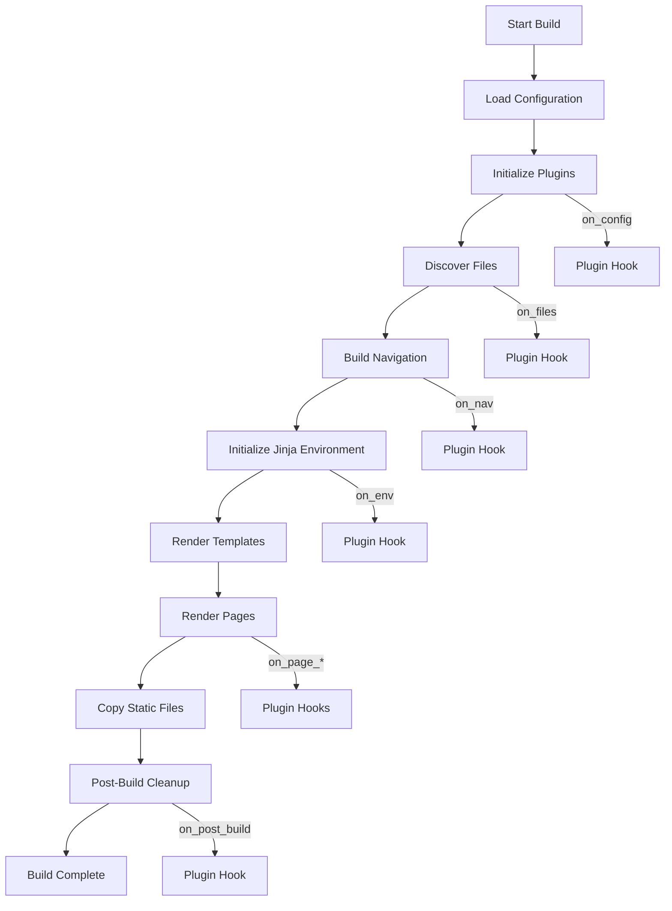

# MkDocs Architecture - How MkDocs Works

## 📋 **Table of Contents**

- [📖 Overview](#-overview)
- [🏗️ Core Architecture](#️-core-architecture)
- [⚙️ Build Pipeline](#️-build-pipeline)
- [🎨 Template System](#-template-system)
- [🔌 Plugin Architecture](#-plugin-architecture)
- [🪝 Hooks (Lightweight Plugins)](#-hooks-lightweight-plugins)
- [🔍 Search System](#-search-system)
- [📁 File Processing](#-file-processing)
- [🌐 Development Server](#-development-server)
- [⚙️ Advanced Configuration Features](#️-advanced-configuration-features)
- [📊 Performance Considerations](#-performance-considerations)
- [📖 References](#-references)

---

## 📖 **Overview**

MkDocs is a **<mark>Python-based static site generator</mark>** designed specifically for creating project documentation.  
Understanding its architecture helps developers:

- **Customize** themes and templates effectively
- **Extend** functionality through plugins
- **Optimize** build performance for large documentation sites
- **Troubleshoot** issues in the build process

**Key Architectural Principles:**

| Principle | Description |
|-----------|-------------|
| **<mark>Static Generation</mark>** | Generates pure HTML/CSS/JS—no server-side processing required |
| **<mark>Markdown-First</mark>** | Content authored in Markdown, converted via Python-Markdown |
| **<mark>Configuration-Driven</mark>** | Single YAML file controls all behavior |
| **<mark>Event-Based Plugins</mark>** | Extensible through well-defined lifecycle events |
| **<mark>Template-Based Theming</mark>** | Jinja2 templates power all HTML generation |

## 🏗️ **Core Architecture**

### High-Level Architecture

MkDocs follows a straightforward **pipeline architecture**:

```
┌─────────────────────────────────────────────────────────────────┐
│                        MkDocs Build Process                      │
├─────────────────────────────────────────────────────────────────┤
│                                                                   │
│   ┌─────────┐    ┌─────────────┐    ┌─────────────┐             │
│   │mkdocs.yml│───▶│Configuration│───▶│  Validation │             │
│   │         │    │   Parser    │    │   Engine    │             │
│   └─────────┘    └─────────────┘    └──────┬──────┘             │
│                                            │                      │
│                                            ▼                      │
│   ┌─────────┐    ┌─────────────┐    ┌─────────────┐             │
│   │  docs/  │───▶│    File     │───▶│  Navigation │             │
│   │  *.md   │    │  Discovery  │    │   Builder   │             │
│   └─────────┘    └─────────────┘    └──────┬──────┘             │
│                                            │                      │
│                                            ▼                      │
│   ┌─────────┐    ┌─────────────┐    ┌─────────────┐             │
│   │ Plugins │───▶│  Markdown   │───▶│   Template  │             │
│   │         │    │  Rendering  │    │   Engine    │             │
│   └─────────┘    └─────────────┘    └──────┬──────┘             │
│                                            │                      │
│                                            ▼                      │
│                                     ┌─────────────┐             │
│                                     │   site/     │             │
│                                     │   Output    │             │
│                                     └─────────────┘             │
│                                                                   │
└─────────────────────────────────────────────────────────────────┘
```

### Core Components

MkDocs consists of several interconnected components:

#### 1. Configuration System

The configuration system parses `mkdocs.yml` and validates all settings:

```python
# Internal configuration structure (simplified)
class MkDocsConfig:
    site_name: str           # Required
    site_url: str | None     # Optional
    nav: list | None         # Navigation structure
    theme: ThemeConfig       # Theme configuration
    plugins: PluginCollection # Enabled plugins
    markdown_extensions: list # Markdown extensions
    docs_dir: str            # Source directory
    site_dir: str            # Output directory
```

#### 2. File System

The `Files` collection manages all documentation files:

```python
# File structure representation
class File:
    src_path: str        # Path relative to docs_dir
    dest_path: str       # Path relative to site_dir
    url: str             # URL for the file
    name: str            # Filename without extension
    abs_src_path: str    # Absolute source path
    abs_dest_path: str   # Absolute destination path
```

#### 3. Navigation System

Navigation is built from the `nav` configuration or auto-generated:

```python
# Navigation structure
class Navigation:
    items: list[NavItem]      # Top-level navigation items
    pages: list[Page]         # All pages in navigation order
    homepage: Page | None     # Homepage reference

class Section:
    title: str
    children: list[NavItem]   # Pages, links, or nested sections
    
class Page:
    title: str
    url: str
    file: File
    content: str              # Rendered HTML content
    toc: TableOfContents      # Page table of contents
    meta: dict                # YAML front matter
```

#### 4. Template System

Jinja2 templates render the final HTML:

```python
# Template context structure
class TemplateContext:
    config: MkDocsConfig      # Configuration object
    nav: Navigation           # Navigation structure
    page: Page | None         # Current page (if rendering a page)
    base_url: str             # Relative path to site root
    mkdocs_version: str       # MkDocs version
    build_date_utc: datetime  # Build timestamp
```

## ⚙️ **Build Pipeline**

### Build Phases

The build process consists of several distinct phases:



### Phase 1: Configuration Loading

```python
# Configuration loading process
def load_config(config_file):
    # 1. Read YAML file
    raw_config = yaml.load(config_file)
    
    # 2. Apply configuration inheritance (INHERIT key)
    if 'INHERIT' in raw_config:
        parent = load_config(raw_config['INHERIT'])
        raw_config = deep_merge(parent, raw_config)
    
    # 3. Validate all options
    config = MkDocsConfig(**raw_config)
    config.validate()
    
    # 4. Trigger on_config event for plugins
    config = plugins.run_event('on_config', config)
    
    return config
```

### Phase 2: File Discovery

MkDocs discovers all files in the `docs_dir`:

```python
# File discovery process
def get_files(config):
    files = Files([])
    
    for path in walk(config.docs_dir):
        # Skip excluded patterns
        if matches_exclude(path, config.exclude_docs):
            continue
            
        # Create File object
        file = File(
            path=path,
            docs_dir=config.docs_dir,
            site_dir=config.site_dir,
            use_directory_urls=config.use_directory_urls
        )
        files.append(file)
    
    # Trigger on_files event
    files = plugins.run_event('on_files', files, config=config)
    
    return files
```

### Phase 3: Navigation Building

Navigation is constructed from configuration or auto-generated:

```python
# Navigation building
def get_navigation(files, config):
    if config.nav:
        # Build from explicit configuration
        nav = build_nav_from_config(config.nav, files)
    else:
        # Auto-generate from file structure
        nav = build_nav_from_files(files)
    
    # Trigger on_nav event
    nav = plugins.run_event('on_nav', nav, config=config, files=files)
    
    return nav
```

### Phase 4: Page Rendering

Each page goes through a multi-stage rendering process:

```python
# Page rendering pipeline
def render_page(page, config, nav, files):
    # 1. Pre-page event
    page = plugins.run_event('on_pre_page', page, config=config, files=files)
    
    # 2. Read source content
    page.read_source(config)
    
    # 3. Get markdown content
    markdown = page.markdown
    markdown = plugins.run_event('on_page_markdown', markdown, 
                                  page=page, config=config, files=files)
    
    # 4. Convert to HTML
    html = markdown_to_html(markdown, config.markdown_extensions)
    html = plugins.run_event('on_page_content', html,
                              page=page, config=config, files=files)
    page.content = html
    
    # 5. Build template context
    context = get_context(page, config, nav)
    context = plugins.run_event('on_page_context', context,
                                 page=page, config=config, nav=nav)
    
    # 6. Render template
    output = theme.render('main.html', context)
    output = plugins.run_event('on_post_page', output,
                                page=page, config=config)
    
    # 7. Write to site_dir
    write_file(page.abs_dest_path, output)
```

## 🎨 **Template System**

### Jinja2 Integration

MkDocs uses **Jinja2** as its templating engine.  
Themes are collections of Jinja2 templates.

#### Basic Template Structure

```html
<!-- main.html - Main page template -->
<!DOCTYPE html>
<html lang="{{ config.theme.locale }}">
<head>
    <meta charset="utf-8">
    <title>{{ page.title }} - {{ config.site_name }}</title>
    
    {# Include extra CSS #}
    
        <link href="{{ css_file | url }}" rel="stylesheet">
    
</head>
<body>
    {# Navigation #}
    
    
    {# Page content #}
    <main>
        {{ page.content }}
    </main>
    
    {# Table of contents #}
    
        
    
    
    {# Include extra JavaScript #}
    
        {{ script | script_tag }}
    
</body>
</html>
```

### Template Variables

Templates have access to these global variables:

| Variable | Type | Description |
|----------|------|-------------|
| `config` | MkDocsConfig | Full configuration object |
| `page` | Page | Current page being rendered |
| `nav` | Navigation | Site navigation structure |
| `base_url` | str | Relative path to site root |
| `mkdocs_version` | str | MkDocs version string |
| `build_date_utc` | datetime | Build timestamp |

### Page Object Attributes

```python
# Available on page object in templates
page.title          # Page title
page.content        # Rendered HTML content
page.toc            # Table of contents
page.meta           # YAML front matter metadata
page.url            # Page URL relative to site root
page.abs_url        # Absolute URL (includes site_url path)
page.canonical_url  # Full canonical URL
page.edit_url       # Link to edit source (if configured)
page.is_homepage    # True if this is the homepage
page.previous_page  # Previous page in navigation
page.next_page      # Next page in navigation
```

### Custom Filters

MkDocs provides custom Jinja2 filters:

```html
{# url filter - Makes URLs relative to current page #}
<a href="{{ 'path/to/page.md' | url }}">Link</a>

{# tojson filter - Safe JSON conversion #}
<script>
    var pageTitle = {{ page.title | tojson }};
</script>

{# script_tag filter - Generates proper script tags #}
{{ script | script_tag }}
```

## 🔌 **Plugin Architecture**

### Plugin System Overview

MkDocs plugins extend functionality through an **event-driven architecture**:

```
┌─────────────────────────────────────────────────────────────────┐
│                      Plugin Event Flow                           │
├─────────────────────────────────────────────────────────────────┤
│                                                                   │
│  ┌──────────────┐                                                │
│  │  One-Time    │  on_startup ──▶ on_shutdown                    │
│  │  Events      │  on_serve                                      │
│  └──────────────┘                                                │
│                                                                   │
│  ┌──────────────┐                                                │
│  │   Global     │  on_config ──▶ on_pre_build ──▶ on_files       │
│  │   Events     │  ──▶ on_nav ──▶ on_env ──▶ on_post_build       │
│  └──────────────┘                                                │
│                                                                   │
│  ┌──────────────┐                                                │
│  │  Template    │  on_pre_template ──▶ on_template_context       │
│  │   Events     │  ──▶ on_post_template                          │
│  └──────────────┘                                                │
│                                                                   │
│  ┌──────────────┐                                                │
│  │    Page      │  on_pre_page ──▶ on_page_markdown              │
│  │   Events     │  ──▶ on_page_content ──▶ on_page_context       │
│  └──────────────┘  ──▶ on_post_page                              │
│                                                                   │
└─────────────────────────────────────────────────────────────────┘
```

### Creating a Plugin

Plugins inherit from `BasePlugin` and implement event handlers:

```python
from mkdocs.plugins import BasePlugin, event_priority
from mkdocs.config import config_options as c
from mkdocs.config.base import Config

class MyPluginConfig(Config):
    """Plugin configuration schema (MkDocs 1.4+ recommended approach)."""
    enabled = c.Type(bool, default=True)
    option_name = c.Type(str, default='default_value')

class MyPlugin(BasePlugin[MyPluginConfig]):
    """Example MkDocs plugin."""
    
    def on_config(self, config):
        """Called after config is loaded."""
        if not self.config.enabled:
            return config
        
        # Modify configuration
        config.site_name += ' (Modified)'
        return config
    
    def on_files(self, files, config):
        """Called after files are collected."""
        # Add, remove, or modify files
        return files
    
    def on_page_markdown(self, markdown, page, config, files):
        """Called for each page's markdown content."""
        # Transform markdown
        return markdown.replace('foo', 'bar')
    
    def on_page_content(self, html, page, config, files):
        """Called after markdown is converted to HTML."""
        # Transform HTML
        return html
    
    @event_priority(-50)  # Run late
    def on_post_build(self, config):
        """Called after build completes."""
        print(f"Site built to: {config.site_dir}")
```

### Event Priority

Control execution order with `@event_priority` (MkDocs 1.4+):

```python
from mkdocs.plugins import event_priority

class MyPlugin(BasePlugin):
    
    @event_priority(100)   # Run first
    def on_files(self, files, config):
        pass
    
    @event_priority(0)     # Default priority
    def on_nav(self, nav, config, files):
        pass
    
    @event_priority(-100)  # Run last
    def on_post_build(self, config):
        pass
```

### Plugin Registration

Register plugins via entry points in `setup.py`:

```python
setup(
    name='mkdocs-my-plugin',
    entry_points={
        'mkdocs.plugins': [
            'my-plugin = my_plugin:MyPlugin',
        ]
    }
)
```

## 🪝 **Hooks (Lightweight Plugins)**

*New in MkDocs 1.4*

For simple customizations without creating a full plugin package, MkDocs supports **hooks**—Python scripts that implement event handlers directly:

```yaml
# mkdocs.yml
hooks:
  - my_hooks.py
```

```python
# my_hooks.py - No plugin class needed!
def on_page_markdown(markdown, page, config, files):
    """Transform markdown before rendering."""
    return markdown.replace('TODO', '⚠️ TODO')

def on_config(config):
    """Modify configuration at build start."""
    print(f"Building: {config.site_name}")
    return config
```

**Key Differences from Plugins:**

| Aspect | Hooks | Plugins |
|--------|-------|--------|
| **Installation** | Just a `.py` file | Requires packaging & pip install |
| **Configuration** | No config schema | Full config validation |
| **Distribution** | Copy file | PyPI package |
| **Use Case** | Project-specific tweaks | Reusable functionality |
| **Event Handlers** | Functions (no `self`) | Methods on `BasePlugin` |

> **Note:** Hook files can import adjacent Python modules normally (MkDocs 1.6+). In older versions, you need to add the path to `sys.path`.

---

## 🔍 **Search System**

### Search Architecture

MkDocs includes a built-in search plugin using **Lunr.js**:

```
┌─────────────────────────────────────────────────────────────────┐
│                      Search System                               │
├─────────────────────────────────────────────────────────────────┤
│                                                                   │
│  Build Time:                                                     │
│  ┌──────────┐    ┌───────────────┐    ┌──────────────────┐      │
│  │  Pages   │───▶│ Index Builder │───▶│search_index.json│      │
│  └──────────┘    └───────────────┘    └──────────────────┘      │
│                                                                   │
│  Runtime:                                                        │
│  ┌──────────────────┐    ┌──────────┐    ┌───────────┐          │
│  │search_index.json│───▶│ Lunr.js  │───▶│ Results   │          │
│  └──────────────────┘    └──────────┘    └───────────┘          │
│                                                                   │
└─────────────────────────────────────────────────────────────────┘
```

### Search Index Structure

The generated `search_index.json`:

```json
{
    "config": {
        "lang": ["en"],
        "separator": "[\\s\\-]+",
        "pipeline": ["stemmer"]
    },
    "docs": [
        {
            "location": "index.html",
            "title": "Home",
            "text": "Welcome to the documentation..."
        },
        {
            "location": "guide/installation.html",
            "title": "Installation",
            "text": "Install the package using pip..."
        }
    ],
    "index": {
        // Pre-built Lunr.js index (optional)
    }
}
```

### Search Configuration

```yaml
plugins:
  - search:
      lang: en
      separator: '[\s\-\.]+'
      min_search_length: 3
      prebuild_index: true  # Requires Node.js
      indexing: full        # 'full', 'sections', or 'titles'
```

## 📁 **File Processing**

### Markdown Processing Pipeline

```
┌─────────────────────────────────────────────────────────────────┐
│                 Markdown Processing Pipeline                     │
├─────────────────────────────────────────────────────────────────┤
│                                                                   │
│  ┌──────────────┐                                                │
│  │  Source.md   │                                                │
│  └──────┬───────┘                                                │
│         │                                                         │
│         ▼                                                         │
│  ┌──────────────┐    Extract YAML front matter                   │
│  │  Meta Parse  │───▶ Store in page.meta                         │
│  └──────┬───────┘                                                │
│         │                                                         │
│         ▼                                                         │
│  ┌──────────────┐    Plugin: on_page_markdown                    │
│  │  Pre-process │───▶ Modify raw markdown                        │
│  └──────┬───────┘                                                │
│         │                                                         │
│         ▼                                                         │
│  ┌──────────────┐    Python-Markdown + Extensions                │
│  │   Convert    │───▶ Generate HTML                              │
│  └──────┬───────┘                                                │
│         │                                                         │
│         ▼                                                         │
│  ┌──────────────┐    Plugin: on_page_content                     │
│  │ Post-process │───▶ Modify HTML output                         │
│  └──────┬───────┘                                                │
│         │                                                         │
│         ▼                                                         │
│  ┌──────────────┐                                                │
│  │  Output.html │                                                │
│  └──────────────┘                                                │
│                                                                   │
└─────────────────────────────────────────────────────────────────┘
```

### URL Generation

MkDocs supports two URL styles:

#### Directory URLs (Default)

```yaml
use_directory_urls: true
```

| Source File | Generated File | URL |
|-------------|----------------|-----|
| `index.md` | `index.html` | `/` |
| `about.md` | `about/index.html` | `/about/` |
| `guide/install.md` | `guide/install/index.html` | `/guide/install/` |

#### Flat URLs

```yaml
use_directory_urls: false
```

| Source File | Generated File | URL |
|-------------|----------------|-----|
| `index.md` | `index.html` | `/index.html` |
| `about.md` | `about.html` | `/about.html` |
| `guide/install.md` | `guide/install.html` | `/guide/install.html` |

## 🌐 **Development Server**

### Live Reload Server

MkDocs includes a development server with live reloading:

```bash
mkdocs serve
```

**Features:**

- **Auto-rebuild**: Rebuilds on file changes
- **Live reload**: Browser automatically refreshes
- **URL simulation**: Matches production URL structure
- **Error reporting**: Clear build error messages

### Server Architecture

```python
# Simplified server architecture
class LiveReloadServer:
    def __init__(self, config):
        self.config = config
        self.watcher = FileWatcher(config.docs_dir)
        
    def serve(self):
        # Initial build
        self.build()
        
        # Start watching for changes
        self.watcher.on_change(self.rebuild)
        
        # Start HTTP server
        self.start_server()
    
    def rebuild(self, changed_files):
        # Incremental rebuild
        self.build()
        # Notify browser to reload
        self.notify_clients()
```

### Watch Configuration

Control which directories trigger rebuilds:

```yaml
watch:
  - custom_theme/
  - includes/
```

## ⚙️ **Advanced Configuration Features**

### Configuration Inheritance (INHERIT)

Multiple MkDocs sites can share common configuration:

```yaml
# base.yml - Shared configuration
theme:
  name: material
markdown_extensions:
  toc:
    permalink: true
```

```yaml
# mkdocs.yml - Site-specific config
INHERIT: ../base.yml
site_name: My Project
site_url: https://example.com/
```

MkDocs deep-merges the configurations, allowing overrides while inheriting defaults.

### Special YAML Tags

MkDocs supports dynamic configuration values:

```yaml
# Environment variables with fallback
site_name: !ENV [SITE_NAME, 'Default Site']

plugins:
  - search
  - expensive-plugin:
      enabled: !ENV [CI, false]  # Only enable in CI

# Relative paths (useful for extensions)
markdown_extensions:
  - pymdownx.snippets:
      base_path: !relative  # Relative to current Markdown file
      # Or: !relative $docs_dir
      # Or: !relative $config_dir
```

### Validation Configuration (MkDocs 1.5+)

Control strictness of link and navigation validation:

```yaml
validation:
  omitted_files: warn
  absolute_links: warn  # Or 'relative_to_docs' (1.6+)
  unrecognized_links: warn
  anchors: warn  # New in 1.6

  nav:
    omitted_files: info
    not_found: warn
    absolute_links: ignore

  links:
    not_found: warn
    anchors: warn
    absolute_links: relative_to_docs  # Validate and convert
```

### Draft and Excluded Documents (MkDocs 1.5+)

```yaml
# Exclude files from build entirely
exclude_docs: |
  drafts/           # Directory anywhere
  *.py              # Python files
  /requirements.txt # Top-level only
  !.assets          # Except .assets

# Draft files: available in serve, excluded from build (1.6+)
draft_docs: |
  _draft.md         # Files ending in _draft.md
  wip/              # Work-in-progress directory
```

---

## 📊 **Performance Considerations**

### Build Performance Factors

| Factor | Impact | Optimization |
|--------|--------|--------------|
| **Page Count** | High | Use `exclude_docs` for unused files |
| **Extensions** | Medium | Disable unused extensions |
| **Plugins** | Medium | Audit plugin performance |
| **Search Index** | Medium | Use `prebuild_index` for large sites |
| **Theme Complexity** | Low | Simplify templates |

### Large Site Optimizations

```yaml
# Optimizations for large documentation sites
plugins:
  - search:
      prebuild_index: true    # Pre-build search index
      indexing: sections      # Index less content

# Exclude non-documentation files
exclude_docs: |
  drafts/
  *.py
  *.sh

# Reduce validation overhead
validation:
  links:
    not_found: ignore
    anchors: ignore
```

### Build Time Comparison

| Site Size | Cold Build | Incremental |
|-----------|------------|-------------|
| ~50 pages | 2-5 seconds | < 1 second |
| ~200 pages | 10-20 seconds | 2-3 seconds |
| ~500 pages | 30-60 seconds | 5-10 seconds |

## 📖 **References**

### Official Documentation

- [MkDocs Documentation](https://www.mkdocs.org/) - Official MkDocs documentation
- [MkDocs Plugin Development](https://www.mkdocs.org/dev-guide/plugins/) - Guide to creating plugins
- [MkDocs Theme Development](https://www.mkdocs.org/dev-guide/themes/) - Guide to creating themes
- [MkDocs Configuration](https://www.mkdocs.org/user-guide/configuration/) - Complete configuration reference
- [MkDocs Release Notes](https://www.mkdocs.org/about/release-notes/) - Version history and changelog
- [MkDocs Translation Guide](https://www.mkdocs.org/dev-guide/translations/) - Theme localization/i18n

### Technical References

- [Python-Markdown](https://python-markdown.github.io/) - Markdown processing library (v3.10)
- [Jinja2 Documentation](https://jinja.palletsprojects.com/) - Template engine documentation (v3.1)
- [Lunr.js](https://lunrjs.com/) - Client-side search library

### Related Resources

- [MkDocs Plugin Catalog](https://github.com/mkdocs/catalog) - Curated catalog of 300+ plugins and themes
- [Material for MkDocs](https://squidfunk.github.io/mkdocs-material/) - Popular theme with 25K+ GitHub stars

---

**Document Status**: ✅ **Complete** | **Last Updated**: 2025-12-23 | **Version**: 1.1

This architecture guide provides the foundation for understanding MkDocs internals, enabling effective customization, plugin development, and performance optimization. Covers MkDocs versions through 1.6.

<!-- 
---
validations:
  grammar:
    last_run: null
    model: null
    outcome: null
    issues_found: 0
  
  structure:
    last_run: null
    model: null
    outcome: null
    has_toc: true
    has_introduction: true
    has_conclusion: true
    has_references: true

  consistency_review:
    status: "completed"
    last_run: "2025-12-23T12:00:00Z"
    model: "claude-sonnet-4.5"
    references_checked: 9
    references_valid: 9
    references_broken: 0
    references_added: 2
    gaps_identified: 8
    gaps_addressed: 5
    change_summary: "Added Hooks section, Advanced Configuration Features section (INHERIT, YAML tags, validation, drafts), updated plugin examples with version annotations, expanded references"

article_metadata:
  filename: "001.001-architecture-how-mkdocs-works.md"
  last_updated: "2025-12-23"
  version: "1.1"
  version_history:
    - date: "2025-12-23"
      changes: "Added MkDocs 1.4-1.6 features: Hooks, Configuration Inheritance, Special YAML Tags, Validation, Draft Documents"
    - date: "2025-12-16"
      changes: "Initial article creation"
---
-->
