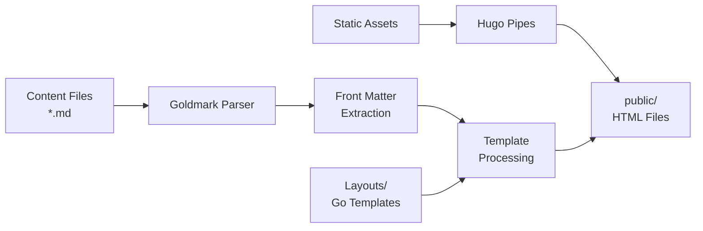

# Introduction to Hugo Static Site Generator

## 📖 Overview

**Hugo** is the world's fastest **open-source static site generator**, built with **Go** and designed for speed, flexibility, and ease of use. Unlike traditional content management systems or slower static site generators, Hugo can build thousands of pages in seconds, making it ideal for documentation sites, blogs, and large-scale content projects.

**Key Characteristics:**
- **Single binary executable** - No runtime dependencies (Node.js, Python, Ruby)
- **Blazing fast builds** - 10-20 seconds for 1000 pages (vs 180-360s for Quarto)
- **Go template system** - Powerful but requires learning curve
- **Flexible content modeling** - Any taxonomy, any structure
- **Production-ready** - Built-in optimization and security features

## 🎯 What Makes Hugo Different

### Speed as a Core Feature

Hugo's performance isn't just "good" - it's exceptional:

```bash
# Build performance comparison (1000 pages)
Hugo:     10-20 seconds    ✅ Fastest
Quarto:   180-360 seconds  🟡 Moderate
Jekyll:   480-900 seconds  🔴 Slow
Gatsby:   240-480 seconds  🟡 Moderate
```

This speed comes from:
- **Native compiled code** (Go) vs interpreted languages
- **Parallel processing** using Go's goroutines
- **In-memory operations** during build
- **Efficient template caching**

### Zero Dependencies

Unlike competitors, Hugo is a **single binary**:

```bash
# Hugo installation
wget https://github.com/gohugoio/hugo/releases/download/v0.122.0/hugo_0.122.0_Linux-64bit.tar.gz
tar -xzf hugo_0.122.0_Linux-64bit.tar.gz
./hugo version
# Done! No npm, pip, gem, or other package managers required

# Compare with Quarto (requires Pandoc, R, Python for full features)
# Compare with Jekyll (requires Ruby, Bundler, gems)
# Compare with Gatsby (requires Node.js, npm, hundreds of dependencies)
```

### Content-First Philosophy

Hugo prioritizes content organization and developer experience:

```
content/
├── _index.md              # Homepage
├── about.md               # Standalone page
├── posts/                 # Blog section
│   ├── _index.md          # Section homepage
│   ├── first-post.md
│   └── second-post.md
└── docs/                  # Documentation section
    ├── _index.md
    ├── getting-started.md
    └── api/
        └── reference.md
```

**Automatic features from structure:**
- Navigation menus
- RSS feeds
- Sitemaps
- Section pages
- Related content

## 🏗️ Hugo Architecture

### Core Components

```
┌─────────────────────────────────────────┐
│         Hugo Binary (Single File)       │
├─────────────────────────────────────────┤
│  Content Processing  │  Template Engine │
│  (Goldmark Parser)   │  (Go Templates)  │
├─────────────────────────────────────────┤
│       Asset Pipeline (Hugo Pipes)       │
│  SCSS │ PostCSS │ JS │ Images │ Minify  │
├─────────────────────────────────────────┤
│            Output Generation            │
│       HTML │ CSS │ JS │ JSON │ XML      │
└─────────────────────────────────────────┘
```

### Build Process



**Build Flow:**
1. **Read configuration** (`config.toml`, `config.yaml`)
2. **Parse content** (Markdown → AST via Goldmark)
3. **Extract front matter** (YAML, TOML, JSON)
4. **Process templates** (Go templates + content)
5. **Build asset pipeline** (SCSS, JS, images)
6. **Generate output** (HTML, CSS, JSON, RSS)
7. **Write to `public/`** directory

### Project Structure

```
my-hugo-site/
├── config.toml              # Site configuration
├── content/                 # Markdown content files
│   ├── _index.md
│   ├── posts/
│   └── docs/
├── layouts/                 # Go template files
│   ├── _default/
│   │   ├── baseof.html     # Base template
│   │   ├── list.html       # List pages
│   │   └── single.html     # Single pages
│   ├── partials/
│   │   ├── header.html
│   │   └── footer.html
│   └── shortcodes/
│       └── youtube.html
├── static/                  # Static files (copied as-is)
│   ├── images/
│   └── fonts/
├── assets/                  # Files processed by Hugo Pipes
│   ├── scss/
│   └── js/
├── data/                    # Data files (YAML/JSON/TOML)
│   └── authors.yaml
├── themes/                  # Installed themes
│   └── mytheme/
└── public/                  # Generated site (Git-ignored)
```

## 🔧 Installation and Setup

### Installing Hugo

**Windows:**
```powershell
# Using Chocolatey
choco install hugo-extended

# Using Scoop
scoop install hugo-extended

# Verify installation
hugo version
```

**macOS:**
```bash
# Using Homebrew
brew install hugo

# Verify installation
hugo version
```

**Linux:**
```bash
# Download latest release
wget https://github.com/gohugoio/hugo/releases/download/v0.122.0/hugo_extended_0.122.0_Linux-64bit.tar.gz

# Extract
tar -xzf hugo_extended_0.122.0_Linux-64bit.tar.gz

# Move to PATH
sudo mv hugo /usr/local/bin/

# Verify
hugo version
```

**Why "extended"?** The extended version includes:
- SCSS/SASS processing
- Image processing features
- WebP support

### Creating Your First Site

```bash
# Create new site
hugo new site my-site
cd my-site

# Initialize Git
git init

# Add a theme (example: hugo-book)
git submodule add https://github.com/alex-shpak/hugo-book themes/hugo-book

# Configure theme in config.toml
echo 'theme = "hugo-book"' >> config.toml

# Create first content
hugo new posts/my-first-post.md

# Start development server
hugo server -D

# Visit http://localhost:1313
```

### Basic Configuration

**config.toml:**
```toml
baseURL = "https://example.com/"
languageCode = "en-us"
title = "My Hugo Site"
theme = "hugo-book"

[params]
  description = "A fast documentation site"
  author = "Your Name"
  
[markup]
  [markup.goldmark]
    [markup.goldmark.renderer]
      unsafe = true  # Allow raw HTML in markdown

[menu]
  [[menu.main]]
    name = "Home"
    url = "/"
    weight = 1
  [[menu.main]]
    name = "Docs"
    url = "/docs/"
    weight = 2
```

## 📝 Creating Content

### Front Matter

Hugo supports three front matter formats:

**YAML (recommended):**
```yaml
---
title: "My Article"
date: 2026-01-14
draft: false
tags: ["hugo", "tutorial"]
categories: ["documentation"]
author: "Dario Airoldi"
---

Your content here...
```

**TOML:**
```toml
+++
title = "My Article"
date = 2026-01-14
draft = false
tags = ["hugo", "tutorial"]
+++

Your content here...
```

**JSON:**
```json
{
  "title": "My Article",
  "date": "2026-01-14",
  "draft": false,
  "tags": ["hugo", "tutorial"]
}

Your content here...
```

### Content Archetypes

Create templates for new content:

**archetypes/posts.md:**
```yaml
---
title: "{{ replace .Name "-" " " | title }}"
date: {{ .Date }}
draft: true
tags: []
categories: []
author: "Dario Airoldi"
description: ""
---

## Introduction

Your content starts here...
```

**Usage:**
```bash
hugo new posts/my-article.md
# Uses archetypes/posts.md template
```

## 🚀 Development Workflow

### Local Development

```bash
# Start development server with drafts
hugo server -D

# Features:
# - Live reload on changes
# - Fast rebuild (milliseconds)
# - Serves at http://localhost:1313
# - Shows drafts and future posts
```

### Building for Production

```bash
# Build optimized site
hugo --minify

# Output to public/ directory
# - Minified HTML, CSS, JS
# - Optimized images
# - Generated RSS, sitemap
# - Cache-busted assets
```

### Build Flags

```bash
# Build with specific environment
hugo --environment production

# Clean generated files
hugo --gc

# Build future-dated posts
hugo --buildFuture

# Build drafts
hugo --buildDrafts

# Verbose output
hugo --verbose

# Combined optimization
hugo --minify --gc
```

## 🆚 Hugo vs Quarto: First Comparison

Since this workspace uses **Quarto**, let's compare the basics:

| Feature | Hugo | Quarto (Current) |
|---------|------|------------------|
| **Primary Use Case** | Static sites, blogs, docs | Scientific publishing, notebooks |
| **Build Speed (500 pages)** | ~5-10 seconds | ~90-180 seconds |
| **Template Language** | Go templates | Pandoc templates |
| **Executable Code** | ❌ No | ✅ Yes (Python, R, Julia) |
| **Learning Curve** | Medium-High | Medium |
| **Single Binary** | ✅ Yes | ❌ No (needs Pandoc) |
| **Multi-format Output** | HTML, JSON, RSS, AMP | HTML, PDF, Word, ePub |
| **Ideal For** | High-performance content sites | Technical docs with code execution |

**When Hugo Makes Sense for Learning Hub:**
- ✅ No executable code needed (pure markdown content)
- ✅ Build performance matters (500+ files)
- ✅ Want maximum customization control
- ✅ Need multilingual support

**When to Keep Quarto:**
- ✅ Need code execution (Jupyter notebooks)
- ✅ Require PDF/Word output
- ✅ Current build times acceptable
- ✅ Team comfortable with Pandoc ecosystem

## 💡 Key Takeaways

1. **Hugo is optimized for speed** - Perfect for large documentation sites
2. **Single binary simplifies deployment** - No dependency management
3. **Go templates are powerful but different** - Steeper learning curve than Liquid/Jinja2
4. **Content-first architecture** - Directory structure defines site organization
5. **Production-ready out of the box** - Built-in optimization and best practices

## 🔜 Next Steps

Continue to [Hugo Core Concepts](01.02-hugo-core-concepts.md) to learn about:
- Page bundles and resource management
- Taxonomies (tags, categories, custom)
- Content organization at scale
- Front matter customization
- Template hierarchy

## 📚 References

- **[Hugo Official Documentation](https://gohugo.io/documentation/)** 📘 Official - Comprehensive guide and reference
- **[Hugo Themes](https://themes.gohugo.io/)** 📘 Official - 500+ community themes
- **[Hugo Discourse Forum](https://discourse.gohugo.io/)** 📗 Verified Community - Active support community
- **[Hugo GitHub Repository](https://github.com/gohugoio/hugo)** 📘 Official - Source code and issue tracking
- **[Hugo vs Jekyll Comparison](https://forestry.io/blog/hugo-vs-jekyll-benchmark/)** 📗 Verified Community - Performance benchmarks
- **[Go Template Documentation](https://pkg.go.dev/text/template)** 📘 Official - Template language reference

<!-- Validation Metadata (Do Not Edit) -->
<!--
article_metadata:
  filename: "01.01-introduction-to-hugo.md"
  series: "Hugo Static Site Generator"
  position: 1
  total_articles: 31
  
validation_status:
  last_run: "2026-01-14T00:00:00Z"
  status: "initial_creation"
  
grammar_review:
  score: null
  issues: []
  
readability_review:
  score: null
  flesch_reading_ease: null
  
structure_review:
  score: null
  has_introduction: true
  has_conclusion: true
  has_references: true
  
fact_check:
  score: null
  claims_verified: []
  
logic_review:
  score: null
  consistency_check: "pending"
-->
